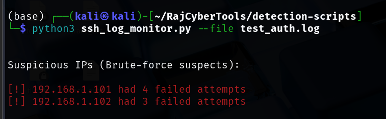
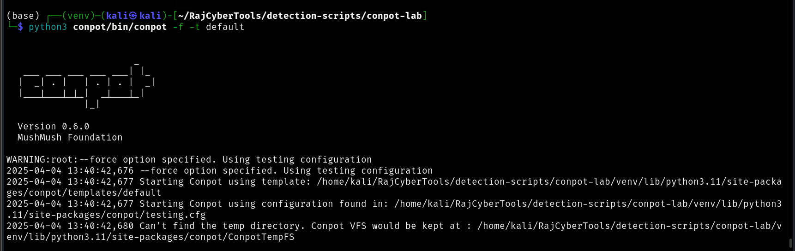
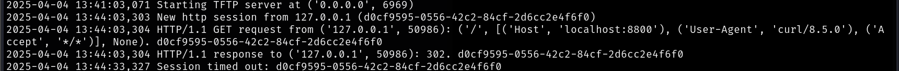
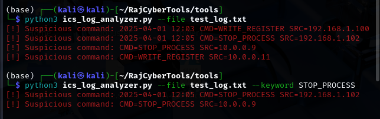
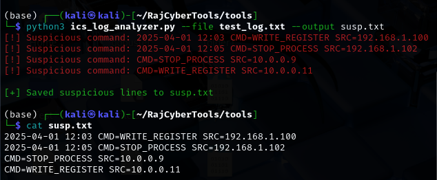
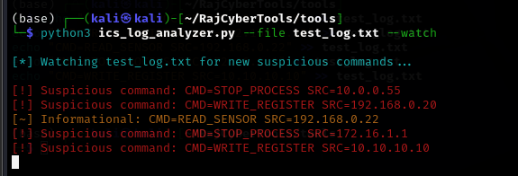

# 🛡️ Raj's Cybersecurity Tools & Labs

Welcome to my personal cybersecurity toolkit — a collection of hands-on projects, scripts, and research built during my MSc in Cybersecurity at the University of York (NCSC Certified). This repo showcases practical skills in **incident response**, **threat detection**, and **OT/ICS security** through real tools and learning resources.

---

## 📁 Repository Structure

### 🔍 Detection Scripts

| Tool                  | Description                                                    |
|-----------------------|----------------------------------------------------------------|
| `ssh_log_monitor.py` | Detects brute-force SSH attempts from `/var/log/auth.log`.     |

---

### 🛡️ SSH Brute-force Detection (`ssh_log_monitor.py`)

This script scans Linux authentication logs (e.g., `/var/log/auth.log`) and identifies IPs that failed multiple login attempts — a common brute-force attack pattern.

#### 📸 Example Output


```
**How it works:**
- Parses lines with `Failed password` entries
- Counts failed attempts per IP
- Flags IPs with 3+ failures (customizable in script)

**Usage Example:**

```bash
python3 ssh_log_monitor.py --file test_auth.log

Or run it without --file to scan your system log directly (requires root):

sudo python3 ssh_log_monitor.py

🧪 You can simulate a test log like this:

echo "Failed password for root from 192.168.1.101 port 22 ssh2" >> test_auth.log
echo "Failed password for root from 192.168.1.102 port 22 ssh2" >> test_auth.log
echo "Failed password for root from 192.168.1.102 port 22 ssh2" >> test_auth.log
echo "Failed password for root from 192.168.1.102 port 22 ssh2" >> test_auth.log

---

### 🧪 Simulated OT Labs

| File                   | Description                                |
|------------------------|--------------------------------------------|
| `conpot_setup_guide.md` | How to deploy a Conpot ICS honeypot locally |

### 🧪 Conpot ICS Honeypot Lab

This lab simulates an Industrial Control System (ICS) environment using the [Conpot](https://github.com/mushorg/conpot) honeypot. It's designed to demonstrate protocol emulation, threat detection, and real-time monitoring.

| File | Description |
|------|-------------|
| `conpot_lab/` | Directory containing the conpot setup scripts and config |
| `conpot_startup.png` | Screenshot showing successful startup of Conpot |
| `curl_request.png` | Screenshot showing simulated curl request to Conpot |
| `conpot_session_log.png` | Screenshot showing protocol session log |

---

### 🛠️ Usage Instructions

1. **Navigate to Conpot directory**:
   ```bash
   cd conpot_lab/conpot

2. **Run Conpot using the default template and testing config**:
     ```bash
    python3 bin/conpot -f -t default

3. **Verify it’s listening using curl**:
     ```bash
    curl http://localhost:8800

📸 Example Screenshots

✅ Conpot Startup
Conpot running with the default template and -f test config:
```

```
✅ Simulated HTTP Request
Testing service using curl to simulate an HTTP GET request:
```


```
✅ Session Log Output
Shows protocol sessions (HTTP, FTP, Modbus, etc.) initializing and logging client activity:
```

```

🔒 Takeaways

    Conpot emulates ICS/SCADA devices and supports common protocols (Modbus, HTTP, SNMP, etc.)

    Great for testing detection use cases in a safe lab setting

    Useful as a feeder for other detection tools or SIEM systems
---


### 📚 Threat Analysis Writeups

| Topic                | Description                                               |
|----------------------|-----------------------------------------------------------|
| `stuxnet_summary.md` | Breakdown of the Stuxnet malware + MITRE mapping + lessons learned |

---

## 🔧 ICS Log Analyzer (`ics_log_analyzer.py`)

A Python-based CLI tool that simulates log detection for ICS/OT environments. It scans logs for **suspicious control commands** (e.g., `STOP_PROCESS`, `WRITE_REGISTER`) and alerts in real time, with options to filter, save, or continuously monitor new entries.

---

## 🚀 How to Use

### 🔍 Basic Scan
```bash
python3 ics_log_analyzer.py --file test_log.txt
```


```
🎯 Filter by Command
python3 ics_log_analyzer.py --file test_log.txt --keyword STOP_PROCESS
```


```
📁 Save Suspicious Output

python3 ics_log_analyzer.py --file test_log.txt --output suspicious.txt

🔁 Real-Time Monitoring (like tail -f)

python3 ics_log_analyzer.py --file test_log.txt --watch
```

```
🧪 Generate Sample Log for Testing

echo "CMD=STOP_PROCESS SRC=192.168.1.100" > test_log.txt
echo "CMD=WRITE_REGISTER SRC=192.168.1.200" >> test_log.txt
echo "CMD=READ_SENSOR SRC=192.168.1.150" >> test_log.txt

Use this file to test all flags and behaviors of the tool.

💡 Skills Demonstrated

    Threat detection logic in Python

    Real-time log monitoring

    CLI design with argparse

    OT/ICS security concepts

    File I/O and output formatting

    Error handling and log simulation

🛠️ Future Additions

Support monitoring multiple files concurrently

YAML-based config for keyword rules and alert behavior

Regex rule engine for advanced detections

Integration with honeypots like Conpot

Log rotation support + alert throttling

GUI frontend or web-based visualizer

👋 About Me

👨‍💻 MSc in Cybersecurity | University of York (NCSC Certified)
🔐 Focus: Incident Response, Threat Detection, ICS/OT Security
🛠️ Always learning, building, and open to collaborations

📫 Connect with me on LinkedIn -- https://www.linkedin.com/in/raj-konkar-b70b512a0/
